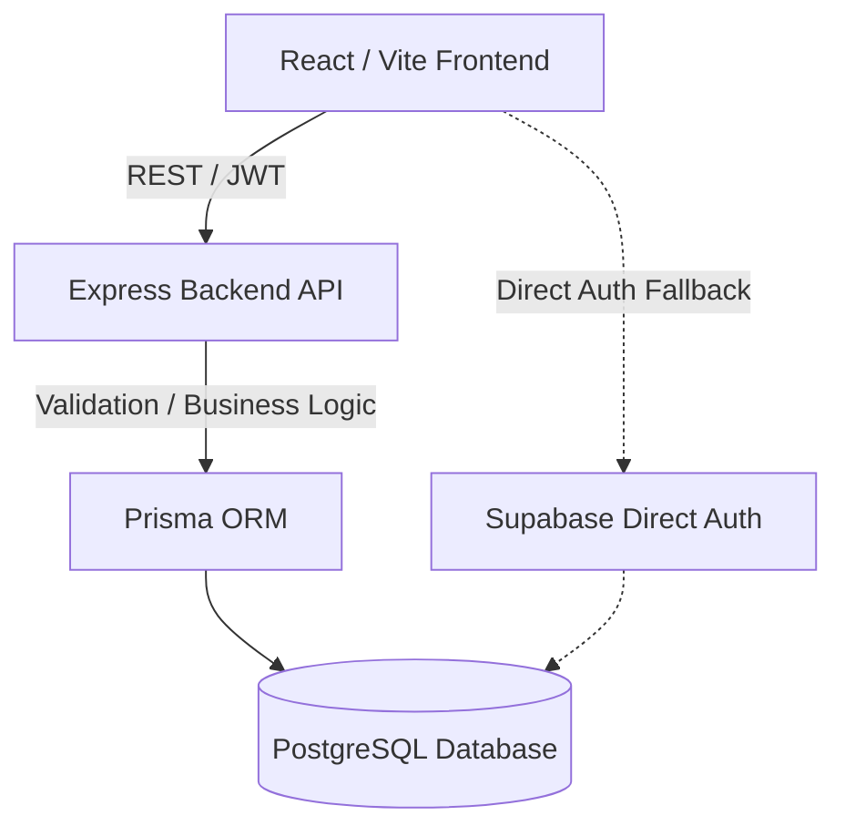

# PharmaFind

### Smart Medicine Discovery & Pharmacy Availability Platform


A full-stack pharmacy discovery platform that helps users search for medicines, identify participating pharmacies with available stock, compare pharmacy information, and navigate supported prescription, ordering, and delivery workflows.

## Academic Project Disclaimer

This project was developed as an academic software engineering project. No separate open-source licence has been assigned unless otherwise stated in the repository. The provided credentials and data are specifically for academic demonstration and testing purposes. 

## Project Overview

PharmaFind is designed to help people locate medicines and identify nearby participating pharmacies with available stock. Finding medicine, especially during emergencies, is often a difficult process that requires visiting multiple pharmacies. PharmaFind addresses this by providing searchable inventory, map-based pharmacy discovery, emergency ranking, secure prescription handling, and role-aware operations workflows.

The current implementation is deployed and demonstrated as a **pilot within and around the University of Ghana, Legon campus**. The pilot covers five pharmacies in this area. While this is the pilot scope, **PharmaFind is NOT a University of Ghana-only application.** Anyone within or around the pilot area may use PharmaFind, including students, university staff, residents, visitors, and other members of the public. 

## Table of Contents

- [Project Scope](#project-scope)
- [Key Features](#key-features)
- [System Roles](#system-roles)
- [Core Workflows](#core-workflows)
- [Screenshots](#screenshots)
- [Technology Stack](#technology-stack)
- [Architecture](#architecture)
- [Project Structure](#project-structure)
- [Prerequisites](#prerequisites)
- [Getting Started](#getting-started)
- [Installation](#installation)
- [Environment Configuration](#environment-configuration)
- [Database Setup](#database-setup)
- [Seeded Medicines Dataset](#seeded-medicines-dataset)
- [Running the Application](#running-the-application)
- [Testing](#testing)
- [API Overview](#api-overview)
- [Security Controls](#security-controls)
- [Deployment Guide](#deployment-guide)
- [Demonstration Credentials](#demonstration-credentials)
- [Known Limitations](#known-limitations)
- [Future Roadmap](#future-roadmap)
- [Contributing](#contributing)
- [License](#license)
- [Acknowledgements](#acknowledgements)

## Project Scope

PharmaFind is a general pharmacy discovery platform. The current phase is an academic pilot focusing on a defined geographic area to test workflows, integrations, and operational logic. The system architecture supports scalability to wider regions in future phases.

## Key Features

### User Features
- Medicine search by generic name, brand name, and category
- Pharmacy discovery with availability and open/closed status
- Distance calculation and nearest pharmacy ranking (Haversine formula)
- Emergency medicine discovery and ranking
- Prescription upload (Image/PDF support with file size limits)
- Delivery requests and tracking
- Payment initialization and verification

### Pharmacy Features
- Inventory management and stock updates
- Prescription review workflows (Approve, Reject, Clarify)
- Pharmacy information and operating hours configuration
- Audit logs for sensitive actions

### Delivery Features
- Delivery request creation
- Driver assignment and tracking
- GPS coordinate logging (simulated tracking)
- Delivery status updates (Requested, Assigned, Collected, In Transit, Delivered, Cancelled)

### Payment Features
- Payment initialization via Paystack
- Test-mode fallback / Mock payments for demonstration
- Webhook handling for idempotency and payment verification
- Payment status records (Pending, Paid, Failed)

### Administration Features
- User role management
- Platform monitoring and audit logs

### Security Features
- JWT authentication and bcrypt password hashing
- Role-based authorization controls (RBAC)
- Ownership checks on protected data
- Zod request validation
- Helmet and CORS middleware
- Auth endpoint rate limiting
- Upload size and type validation
- Centralized JSON errors with request IDs

## System Roles

### USER
Ordinary users who search for medicines, upload prescriptions, and request deliveries.

### PHARMACIST
Responsible for prescription review, clarifications, and approval workflows. Linked to a specific pharmacy.

### PHARMACY_ADMIN
Responsible for pharmacy administration, managing inventory, pricing, and viewing pharmacy-level metrics.

### DRIVER
Responsible for accepting delivery requests, navigating to pharmacies to collect medicines, and updating delivery statuses. 

### SYSTEM_ADMIN
Responsible for platform-level administration, viewing audit logs, and overseeing global operations.

## Core Workflows

### Medicine Search
```text
Search Medicine
        ↓
Find Matching Drug
        ↓
Retrieve Available Inventory
        ↓
Retrieve Pharmacy Information
        ↓
Calculate Distance
        ↓
Rank Pharmacies
        ↓
Display Results
```

### Prescription Processing
```text
Select Medicine
      ↓
Prescription Required
      ↓
Upload Prescription (Image/PDF)
      ↓
OCR Extraction (for images)
      ↓
Prescription Review (by Pharmacist)
      ↓
Approve / Reject
      ↓
Notify User
```

### Delivery Management
```text
Order Created
      ↓
Delivery Request Created
      ↓
Driver Assigned
      ↓
Navigate to Pharmacy
      ↓
Medicine Collected
      ↓
In Transit
      ↓
Medicine Delivered
      ↓
Delivery Completed
```

### Payment Verification
```text
Initialize Payment (Mock or Paystack)
      ↓
Process Transaction
      ↓
Verify Payment (Direct or via Webhook)
      ↓
Update Delivery Request Status
```

## Screenshots

### Home Page


### Pharmacy Locator


### Inventory Dashboard


### Prescription Upload


### Driver Tracking


## Technology Stack

### Frontend
- React (19.x)
- TypeScript
- Vite
- Tailwind CSS
- Leaflet & React-Leaflet
- Supabase Client (Authentication Fallback)

### Backend
- Node.js (Express 5.x)
- TypeScript
- Zod (Validation)
- Prisma (ORM)
- JWT & bcryptjs (Authentication/Security)

### Database
- PostgreSQL
- Prisma ORM

### Integrations
- **Payments:** Paystack (Test-mode / Mock support)
- **OCR:** Tesseract.js (Image text extraction)
- **Maps:** Leaflet + OpenStreetMap
- **SMS:** Twilio / Hubtel adapters (Mock mode supported)
- **Auth:** Supabase Direct Auth Fallback

### Testing
- Vitest

## Architecture



The architecture primarily uses an Express API connecting to a PostgreSQL database via Prisma. A direct Supabase client is also present in the frontend as a fallback authentication mechanism if the external backend API is unavailable. 

## Project Structure

```text
pharmafind/
├── client/                 # React frontend application
│   ├── src/                # Frontend source code
│   ├── public/             # Static assets
│   ├── package.json        # Frontend dependencies
│   └── vite.config.ts      # Vite configuration
├── server/                 # Express backend application
│   ├── src/                # API source code (routes, controllers, services)
│   ├── prisma/             # Prisma schema and database seeds
│   ├── tests/              # Backend test files
│   ├── package.json        # Backend dependencies
│   └── .env.example        # Backend environment template
├── docs/                   # Additional documentation
├── docker-compose.yml      # Local database container configuration
├── package.json            # Root workspace configuration
└── README.md               # Project documentation
```

## Prerequisites

- Node.js (v18 or higher recommended)
- npm
- PostgreSQL (or Docker for running via `docker-compose`)
- Git

Optional integrations for full functionality:
- Paystack Test Account
- Supabase Project (if using the fallback auth)

## Getting Started

1. **Clone the repository:**
   ```bash
   git clone <repository-url>
   cd pharmafind
   ```

2. **Install dependencies:**
   The project uses npm workspaces. Run the following in the root directory:
   ```bash
   npm install
   ```

## Environment Configuration

Copy the example environment files in both the client and server directories:

```bash
cp server/.env.example server/.env
cp client/.env.example client/.env.local
```

### Important Server Variables (`server/.env`)
- `DATABASE_URL`: Your PostgreSQL connection string.
- `JWT_SECRET`: Secret key for signing JSON Web Tokens.
- `STORAGE_DIR`: Local directory for file uploads (e.g., `uploads`).
- `PAYSTACK_SECRET_KEY`: (Optional) For Paystack test mode integrations.
- `SMS_PROVIDER`: Set to `MOCK` for local development.

### Important Client Variables (`client/.env.local`)
- `VITE_API_BASE_URL`: URL of the backend API (e.g., `http://localhost:4000/api`).
- `VITE_MOCK_PAYMENTS`: Set to `true` to use the mocked payment gateway.
- `VITE_SUPABASE_URL` / `VITE_SUPABASE_ANON_KEY`: (Optional) If using direct Supabase auth fallback.

## Database Setup

1. **Start the database:**
   If you have Docker installed, you can start a local PostgreSQL container:
   ```bash
   docker compose up -d
   ```

2. **Run migrations and seed the database:**
   Execute these commands from the root directory:
   ```bash
   npm run prisma:migrate
   npm run prisma:seed
   ```

## Seeded Medicines Dataset

The application ships with a preloaded medicine dataset to support academic demonstration and pilot testing. It contains 20 medicines across various categories (Pain Relief, Antibiotics, Emergency, etc.). 

The complete seeded medicine catalogue is available in [docs/seeded-medicines.md](docs/seeded-medicines.md).

## Running the Application

You can start both the frontend and backend concurrently from the root directory:

```bash
npm run dev
```

Alternatively, run them individually:
- **Backend:** `npm run dev:server` (Starts on `http://localhost:4000`)
- **Frontend:** `npm run dev:client` (Starts on `http://localhost:5173`)

## Testing

The project uses Vitest for backend testing. Currently, frontend tests are not configured.

Run backend tests:
```bash
npm run test:server
```

Run all configured tests from the root:
```bash
npm test
```

## API Overview

| Module | Base Route | Purpose | Authentication |
|---|---|---|---|
| Authentication | `/api/auth/*` | Registration, login and authentication | Public |
| Drugs | `/api/drugs/*` | Medicine search and management | Role-dependent |
| Pharmacies | `/api/pharmacies/*` | Pharmacy discovery and management | Role-dependent |
| Prescriptions | `/api/prescriptions/*` | Prescription workflow and review | Authenticated / Pharmacist |
| Inventory | `/api/inventory/*` | Stock management | Pharmacy/Admin |
| Deliveries | `/api/deliveries/*` | Delivery lifecycle | Authenticated |
| Drivers | `/api/drivers/*` | Driver operations | Driver |
| Payments | `/api/payments/*` | Payment initialization and verification | Authenticated |
| Notifications | `/api/notifications/*` | User notifications | Authenticated |
| Audit Logs | `/api/audit-logs/*` | Sensitive activity records | Admin |

## Security Controls

- **Authentication:** JWT signing with configurable expiry, fallback to direct Supabase auth.
- **Passwords:** Hashed using bcryptjs.
- **Authorization:** strict Role-based access control (RBAC) middleware verifying roles.
- **Validation:** Zod schemas validate request payloads.
- **Middleware:** Helmet for security headers and CORS for cross-origin requests.
- **Rate Limiting:** Auth endpoints are rate-limited to prevent brute-force attacks.
- **File Uploads:** Validated by mimetype and extension; 5MB size restriction.
- **Audit Logging:** System logs critical actions (e.g., payments, prescription reviews).

## Deployment Guide

- **Frontend:** Deploy `client` on Vercel. Ensure `VITE_API_BASE_URL` is set to the backend URL.
- **Backend:** Deploy `server` on a Node.js provider (e.g., Render, Railway). Set environment variables, and run `npm run prisma:migrate` during the build phase.
- **Database:** Use a managed PostgreSQL provider (e.g., Supabase, Neon) and provide the `DATABASE_URL` to the backend.

## Demonstration Credentials

<details>
<summary><strong>Academic Demonstration Credentials</strong></summary>

These credentials are provided strictly for academic demonstration and testing. They must not be used for production deployment.

| Username | Email | Password | Role |
|---|---|---|---|
| testuser | testuser@pharmafind.local | Test123! | User |
| campusadmin | campusadmin@pharmafind.local | Admin123! | Pharmacy Admin |
| pharmacist1 | pharmacist1@pharmafind.local | Pharma123! | Pharmacist |
| driver1 | driver1@pharmafind.local | Driver123! | Driver |

**Login:** Use either the username or email address with the password.

</details>

## Known Limitations

- **OCR Limitations:** Optical Character Recognition (OCR) via Tesseract.js only supports image files. PDF parsing is currently not implemented for OCR.
- **GPS Limitations:** Driver GPS tracking is simulated and stores static coordinates rather than real-time tracking streams.
- **Payment Verification:** Paystack integration is implemented but relies heavily on test-mode/sandbox and a mock payment adapter for local demonstration.
- **Delivery Workflow:** The delivery lifecycle is simulated in state transitions without live driver routing.
- **SMS Integration:** SMS providers (Twilio/Hubtel) have scaffolded adapters, but default to mock outputs.

## Future Roadmap

### Phase 1 – Pilot Stabilisation
- Improved automated testing for the React frontend
- Security hardening
- Better reporting capabilities

### Phase 2 – Live Inventory Integration
- External Pharmacy APIs
- Inventory synchronisation and stock freshness
- Low-stock alerts and expiry monitoring

### Phase 3 – Production Payment and Delivery
- Live Paystack integration with payment reconciliation
- Real delivery assignment and driver onboarding

### Phase 4 – Live GPS
- Consent-based driver tracking with real-time location and dynamic ETA
- Route monitoring

### Phase 5 – Geographic Expansion
Expand from the Legon Pilot to Greater Accra, other regions, and eventually national coverage. This would require appropriate operational, security, regulatory and healthcare-sector considerations.

## Contributing

1. Fork the repository.
2. Create a feature branch (`git checkout -b feature/your-feature`).
3. Make changes.
4. Run tests (`npm test`).
5. Commit changes (`git commit -m 'Add your feature'`).
6. Open a pull request.

Significant architectural or security changes should be documented in the pull request.

## License

This project was developed as an academic software engineering project. No separate open-source licence has been assigned unless otherwise stated in the repository.

## Acknowledgements

- **University of Ghana, Department of Computer Science**
- Open-source technologies and services used in this project (React, Node.js, Leaflet, Tesseract.js, Prisma, PostgreSQL).
